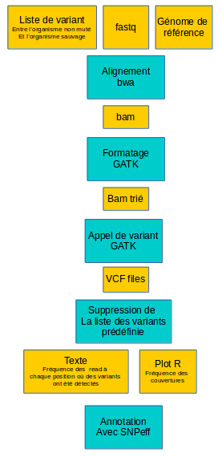
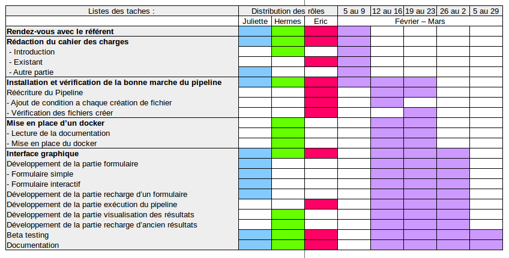

# Cahier des charges

<!-- Version brouillon n'hésitez pas à la modifier ou à mettre des commentaires pour qu'on en discute :) -->

## Présentation du projet

### Contexte

La mutagenèse est un processus par lequel l'information génétique d'un organisme, et donc celle de son ADN est modifiée, ce qui entraîne une mutation.

L'apparition des mutants dans une population est un phénomène rare avec une très faible probabilité<!-- et donc aillant une faible probabilité de se produire -->. Afin d'augmenter cette probabilité, les organismes peuvent être traités par des agents mutagènes qui vont introduire des mutations (remplacement, modification ou endommagement) sur l'organisme de manière aléatoire. Ces agents mutagènes peuvent être de nature chimique comme EMS (_Méthanesulfonate d'éthyle_),de nature physique comme la lumière ultraviolette et les radiations ionisantes ou de nature bactérienne pathogènique contenant des plasmides (ex: _T DNA_) capables de s'intègrer au génome de l'hôte.
<!-- integre un gene au génome de l'hote cad séquence ADN capable ou nos de s'exprimer -->

Provoquer des mutations dans un organisme d’intérêt permet de localiser les gènes d’intérêts, de les cartographier et d'en déduire des informations sur le rôle des gènes. L'identification des mutations responsables du phénotype du mutant constitue le principe de base de la "génétique classique" <!-- pas medelienne plutot? -->. La méthode utilisée pour identifier la mutation recherchée est celle du clonage positionnel.

C'est une méthode utilisée dans les cas où on ne connaît ni la séquence, ni la fonction du gène mais dont la mutation est supposée être à l'origine d'un caractère phénotypique <!-- visible -->. Un croisement avec une lignée génétiquement différente n'ayant pas le phénotype mutant est réalisé. Suite au croisement, il est nécessaire de génotyper un grand nombre d'individu et cela est une tâche fastidieuse prenant beaucoup de temps. La révolution dans les nouvelles technologies de séquençage et d'assemblage du génome a facilité le processus. Aujourd'hui on peut séquencer plusieurs mutants en même temps et analyser les variations génomiques sur tout le génome en une seule fois.

Toutefois, c'est une analyse bioinformatique qui requiert de nombreuses étapes ainsi que l'utilisation de plusieurs programmes et logiciels distincts. La plupart des programmes utilisés sont adaptés à un organisme modèle ou à un « design » génétique, et dépendent de serveurs distants. Afin de faciliter l'étape de cartographie et l'identification des mutations, un pipeline appelé "_Andalusian_Mapping_" a été développé. Ce pipeline permet de travailler avec différentes espèces et souches de cartographie.

<!--Dans cette analyse nous utiliserons des plantes qui sont capables de se reproduire avec elle même (selfing ou self-fertilization). Ce qui va nous être très être très utiles.

La question principale que l'on se pose est comme trouver la position de la mutation que l'on cherche? Par exemple on cherche le ou les gènes résponsable de la couleurs des feuilles. On va muter un grand nombre de plantes et si par chanche on se rend compte que l'un des pénotype a une couleur de feuille différente on a toucher ce ou ces gènes d'intéret. On va alors procéder par croissement pour esayer de retrouer le locus de notre mutation.

Les croisements :

+ **M0** : ligné sauvage de l'organisme d'interet.
+ **M1** : On va dans un premier temps générer des mutations dans des organismes d'interet M0. Avec des agent chimique, des onde ou des bactérie TDNA.
+ **M2** : La première génération obetnu par auto reproduction. Elle regroupe le fardeau mutationnel de son parent. A cete étpa on ne va pas voir les mutation recessive puique l'on a que des organisme hétérozygote.

+ **F1** : On va ensuite croiser les mutant créer en M2 avec une génération M0 sauvage. La génération obtenu nous indique si notre gène d'interet est dominant ou recessif, si on voit le phéntotipe le gène est dominant sinon il est recessif. Toute cette génération est hétérozygote.
+ **F2** : On obtient cette génération par retro reproduction de la génération F1. A cette étape on calcul les proportion de mutant/sauvage que l'ont obtient. Si l'on est proche des proportion medelienne on sais que le ou les mutations qui génère notre phétotipe sont proche l'une de l'autre. On est dans le cadre d'une ségrégation 3-1.
+ **F3** :

Le ségrégation c'est la séparation des phénotype grâce a une descendance, on sépare les trait récessif des parents.
-->
### Objectifs

L’objectif principal de ce projet consiste à créer une interface pour le remplissage d'un formulaire nécessaire au lancement du pipeline développé et d'une interface permettant un affichage clair des résultats de sortie.

On cherchera dans un premier temps à fournir un formulaire simple où l'on devra renseigner tous les champs. Puis on vise l'implémentation, dans la mesure du possible, <!-- l'implémentation du --> le remplissage automatique de certains champs si l'utilisateur le souhaite. Certains champs pourront être remplis via des scripts développés par le maître d’œuvre.

Il serait aussi appréciable, mais optionnel, d’apporter des conseils sur l’amélioration du pipeline en lui-même. Par exemple : faciliter l’installation des dépendances liées aux logiciels utilisés.

### Description de l'existant

Récemment, Cloudmap, un pipeline automatique de mapping-by-sequencing et d'identification de mutants a été développé et intégré à Galaxy, qui est une interface utilisateur simple et intuitive.
Cependant, ce pipeline ne permet pas à ce jour de travailler avec des génomes de référence "exotiques", étant donné que seuls les gènomes modèles comme *Caenorhabditis elegans* ou *Arabidopsis thaliana* sont disponibles sur Galaxy.
*Andalusian Mapping* a donc été développé dans le but de fournir un outil similaire afin de travailler avec des organismes non-modèles.

*Andalusian Mapping* est un pipeline permettant d'effectuer une cartographie par séquençage afin d'identifier les régions les plus susceptibles d'être responsables d'une mutation.
Ce pipeline est un script bash permettant l'utilisation en une seule étape de plusieurs outils bioinformatiques.

SCHEMA DU PIPELINE

L'objectif de ce pipeline est de rendre suffisament simple l'utilisation de ces outils afin d'être accessible à la communauté scientifique sans nécessité d'un background informatique. Il tourne sous environnement Linux et Mac.
Une mise en place de ces logiciels est cependant nécessaire :

* bwa version 0.7.5a-r405 ou supérieur
* samtools version 0.1.18 ou supérieur
* Picard Version 1.110 ou supérieur
* GATK Version 3.7 ou supérieur
* R Version 3.3 ou supérieur, avec le package ggplot2.
* snpEff Version 4.1g ou supérieur

Description du pipeline dans son ensemble :

_A compléter_

### Critère d'acceptabilité du produit

Afin de répondre à la problématique, une interface graphique sera développée. Elle devra permettre la rédaction du formulaire en entrée de pipeline, son exécution et enfin, la visualisation des résultats de sorties.

Le logiciel devra être facile d'utilisation et informatif.

## Expression des besoins

### Besoins fonctionnels

Fonctionnalité du code :

Les fonctionnalités que doit remplir le code permettant la rédaction du fichier d'entrée du pipeline :

+ remplir les champs du fichier source (configuration du pipeline)
+ Dans un second temps, on pourra prévoir un remplissage de certains champs automatiquement via des pipelines développés par le maître d'ouvrage.

Les fonctionnalités que doit remplir le code permettant la sortie des résultats :

+ Visualisation claire des graphiques d’intérêt.

### besoins non fonctionnels

L'interface développée est réalisée sous le système d'exploitation Linux, il comprendra des parties en Shell, en Python et on utilisera également *pyQt*, une librairie graphique python.

## Contraintes

### Délais

Le projet s'organise sur une période de 4 semaines. Il débutera le lundi 5 février et prendra fin le vendredi 2 mars. Le projet pourra être continué durant une période de cours allant du 5 au 29 mars.

Un cahier des charges définitif devra être présenté le lundi 12 février.

Le délivrable final devra être rendu le 29 mars 2018.

### Autres contraintes

## Déroulement du projet

### Planification

### Plan d'assurance qualité

Le contrôle qualité de l'interface développée consistera en une bonne exécution, simple et sans erreurs.
<!-- Jeu test allegé -->

* Le logiciel sera testé par des membres de différentes équipes :
* Validation par _Dr Besnard_
* Utilisation du logiciel par des utilisateurs non initiés en informatique

## Responsabilités

### Maîtrise d'ouvrage

Ce projet nous a été proposé par Fabrice Besnard, biologiste rattaché à l’École Normale Supérieur de Lyon (ENS), travaillant au Laboratoire de Reproduction et Développement des Plantes (RDP).

### Maître d’œuvre

Pour réaliser ce projet, nous serons trois étudiants en Master 1 de Bio-informatique à Lyon 1 : Juliette Geoffray, Hermes Paraqindes et Eric Cumunel.
